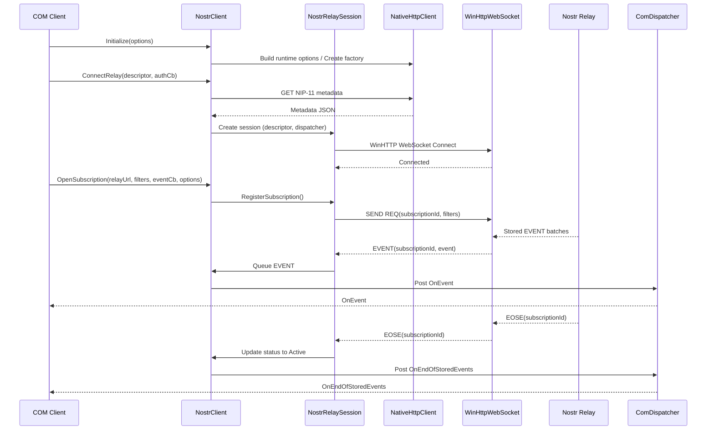
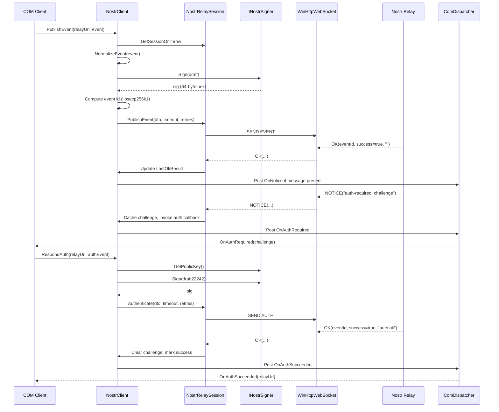

# Native Sequence Diagrams (2025-09-23)

## Relay 接続と購読開始 (NIP-11/NIP-15)
`NostrClient.Initialize` 後に `ConnectRelay` → `OpenSubscription` する流れを C++/ATL で再現するためのシーケンス図。WinHTTP を介したメタ取得と WebSocket 接続、EOSE ハンドリング、コールバック直列化を表している。

## EVENT 送信と AUTH 応答 (NIP-20/NIP-42)
署名者 (`INostrSigner`) を COM 経由で呼び出しつつ EVENT/AUTH を送信し、`OK` / `NOTICE` / `auth-required` を処理する流れ。

